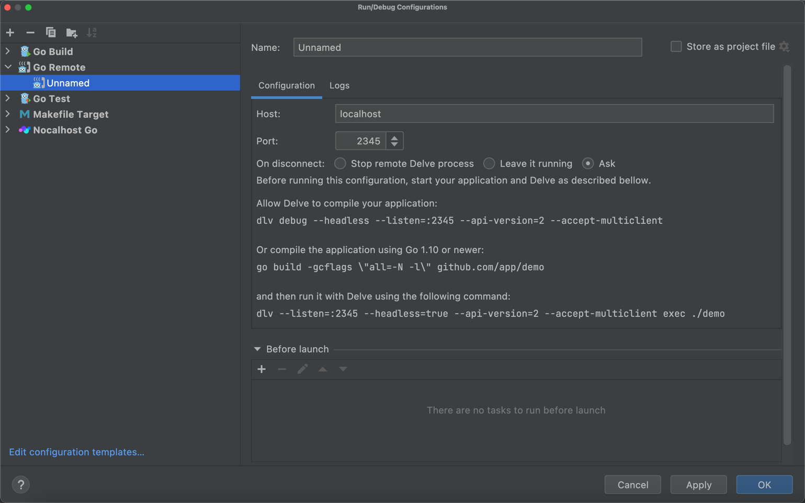
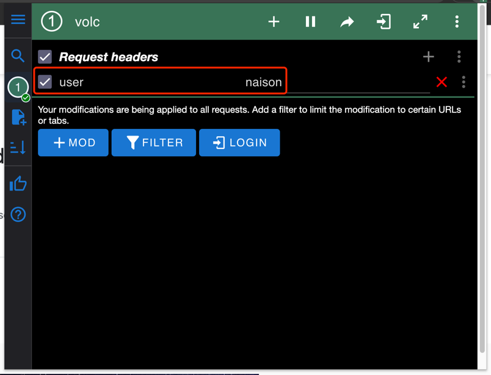
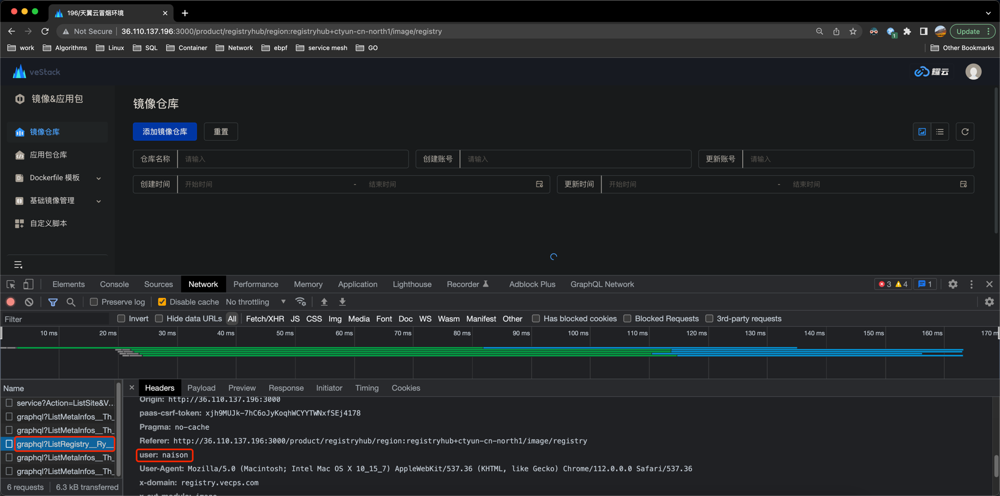
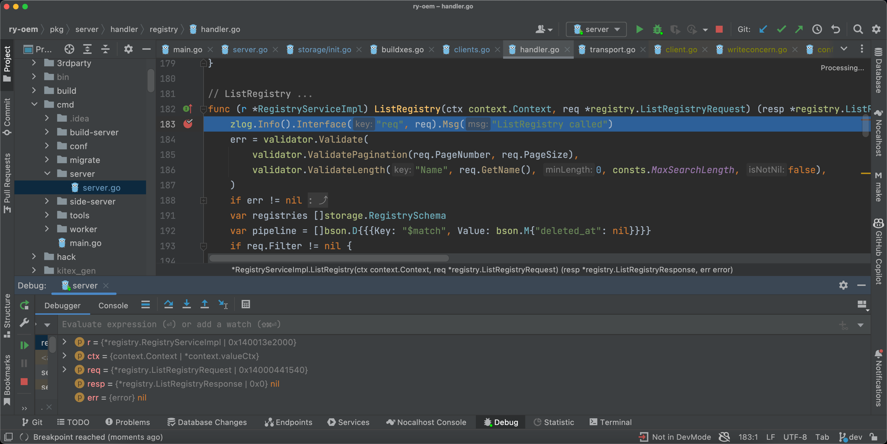
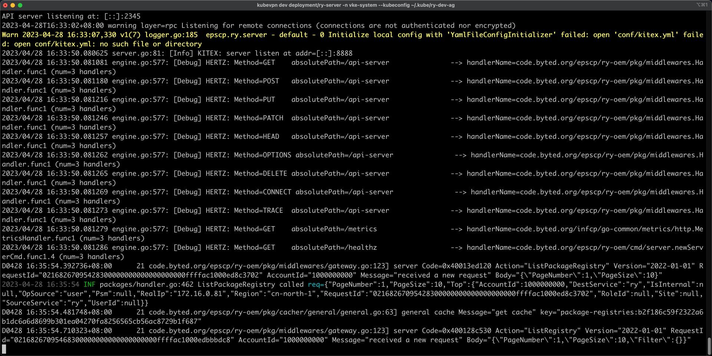

# 使用 run 模式本地调试 server

## 环境准备

- 下载最新版 KubeVPN，[链接](https://github.com/wencaiwulue/kubevpn/releases/tag/v1.1.30)

```shell
KubeVPN: CLI
    Version: v1.1.30
    Image: docker.io/naison/kubevpn:v1.1.30 # 默认会使用这个镜像在集群中创建pod，用于打通网络，可以使用 --image 参数覆盖
    Branch: HEAD
    Git commit: dd88ef6
    Built time: 2023-04-11 12:56:11
    Built OS/Arch: linux/amd64
    Built Go version: go1.19.8
```

- 准备集群 kubeconfig
  示例：

```shell
# 集群 kubeconfig
{"kind":"Config","apiVersion":"v1","preferences":{},"clusters":[{"name":"internalCluster","cluster":{"server":"https://10.1.0.56:5443","certificate-authority-data":"LS0tLS1CRUdJTiBDRVJUSUZJQ0FURS0tLS0tCk1JSUREekNDQWZlZ0F3SUJBZ0lCQURBTkJna3Foa2lHOXcwQkFRc0ZBREFwTVJrd0Z3WURWUVFLRXhCRFEwVWcKVkdWamFHNXZiRzluYVdWek1Rd3dDZ1lEVlFRREV3TkRRMFV3SGhjTk1qTXdNekE1TURjME9UQTJXaGNOTkRNdwpNekE1TURjME9UQTJXakFwTVJrd0Z3WURWUVFLRXhCRFEwVWdWR1ZqYUc1dmJHOW5hV1Z6TVF3d0NnWURWUVFECkV3TkRRMFV3Z2dFaU1BMEdDU3FHU0liM0RRRUJBUVVBQTRJQkR3QXdnZ0VLQW9JQkFRRGZVZ1NJQ1RBSUY2Z0UKZXM3bVRYZFk4N0F2bmhIek5PNDdGbFJBZ2RVYkU5K2l4MmFZVDlDVUdMdzJzTDIvQjcveTlNdmlveklHYjEwaApYenA3Wmo4czVuUUV0WFQvOGVqby90VUtPNzI3YVJrZ1kyZTlqcGYybkZtZURwTEdGRklRa0ZGdS95RFlHYVNFCi9pa2tuWHhhMnB3aTl4aWtNUk4yZ2NiTlRJWGM0NlhNNjhxbjdNWGNibVNCUEg1SDJwTkdyU2pYTnpxaWVPajAKbFlMeFNXNWJpNi9sUmZwY0VLTENMQm4zZXZOYzBHU2ZTcDB1ZkpDVnQ0VEMveXR0OFp4QVpEeG02RS8xUTlPagp4TE50UENwaDkvaTJNTlZLaE5KOU42dmxBdFZuT1hQcjEyVUF4OTJQS3lXenR3bGM0MDRSMTVIbnVMb1YwTkQxCkM2VXY1T2c3QWdNQkFBR2pRakJBTUE0R0ExVWREd0VCL3dRRUF3SUNwREFQQmdOVkhSTUJBZjhFQlRBREFRSC8KTUIwR0ExVWREZ1FXQkJURGk4dHlVdjhESXJhTW9laE5iNGZRSVpBVDZqQU5CZ2txaGtpRzl3MEJBUXNGQUFPQwpBUUVBMGhtZDVqZUdXb1QwMS9MWnVmeDVQdjR0SldXbzAxc1FWMlpqTFB2Mk95ZXE3azc3TTFBay9LTHc3aXFKCjJDTitLM08xSTVZeEU2TmFOd2ttc3pqRVJLcmYyS1BERnJHQWhidWxkejcyUE9XZk5xUDZ5M0wwbk1UVHRMQ3IKeWQ5ZnUvYTJjenNjdVEvS0hpdFRmSTNOSEpqbGkwSGlaSGpraGJMSnE1d3F1b28xR0k0Z3BiemZCN0lvdGppSgp3UTlXOEMzY0NDaHd0UmdjanE2RjMyb1hGU21xUkg2QUY1Yjl1OXlvYXAwbVhWeVRlUUtId0FLUzRhcU9zdDFVCnlqYW5rMUt4VGdicjZhOHZ0ZC9QSUh6TnM2WUlscEtQQWZPSE5LSXZuUFdaTytzMWNaNFNGSFdpWElRM3RXRXoKODY2WVlyYXFYdjZ6bmpyYnh4MzRuQllzVkE9PQotLS0tLUVORCBDRVJUSUZJQ0FURS0tLS0tCg=="}}],"users":[{"name":"user","user":{"client-certificate-data":"LS0tLS1CRUdJTiBDRVJUSUZJQ0FURS0tLS0tCk1JSURZRENDQWtpZ0F3SUJBZ0lJWXZ6NDZYWkxmcTR3RFFZSktvWklodmNOQVFFTEJRQXdLVEVaTUJjR0ExVUUKQ2hNUVEwTkZJRlJsWTJodWIyeHZaMmxsY3pFTU1Bb0dBMVVFQXhNRFEwTkZNQjRYRFRJek1ETXdPVEE0TXpFMQpNVm9YRFRJNE1ETXdPVEE0TXpFMU1Wb3diVEZBTUJVR0ExVUVDaE1PYzNsemRHVnRPbTFoYzNSbGNuTXdKd1lEClZRUUtFeUF3WXpZNU1HUXdaalUxT0RJNVpqRmlNMlkyTVdNd01XSTJOMk15WldJNFlqRXBNQ2NHQTFVRUF4TWcKTUdNMlptVXhNRGRsTkRneVlURTJNakZtWlRKak1ERmlNR1EzTUdReE5qRXdnZ0VpTUEwR0NTcUdTSWIzRFFFQgpBUVVBQTRJQkR3QXdnZ0VLQW9JQkFRRGZVZ1NJQ1RBSUY2Z0VlczdtVFhkWTg3QXZuaEh6Tk80N0ZsUkFnZFViCkU5K2l4MmFZVDlDVUdMdzJzTDIvQjcveTlNdmlveklHYjEwaFh6cDdaajhzNW5RRXRYVC84ZWpvL3RVS083MjcKYVJrZ1kyZTlqcGYybkZtZURwTEdGRklRa0ZGdS95RFlHYVNFL2lra25YeGEycHdpOXhpa01STjJnY2JOVElYYwo0NlhNNjhxbjdNWGNibVNCUEg1SDJwTkdyU2pYTnpxaWVPajBsWUx4U1c1Ymk2L2xSZnBjRUtMQ0xCbjNldk5jCjBHU2ZTcDB1ZkpDVnQ0VEMveXR0OFp4QVpEeG02RS8xUTlPanhMTnRQQ3BoOS9pMk1OVktoTko5TjZ2bEF0Vm4KT1hQcjEyVUF4OTJQS3lXenR3bGM0MDRSMTVIbnVMb1YwTkQxQzZVdjVPZzdBZ01CQUFHalNEQkdNQTRHQTFVZApEd0VCL3dRRUF3SUZvREFUQmdOVkhTVUVEREFLQmdnckJnRUZCUWNEQWpBZkJnTlZIU01FR0RBV2dCVERpOHR5ClV2OERJcmFNb2VoTmI0ZlFJWkFUNmpBTkJna3Foa2lHOXcwQkFRc0ZBQU9DQVFFQVNzcGlXUiswVklIZklDQWYKRi81bCt1QUtmdlczWGNsdEhRMDNZTktqS1hPYitPRG9DY3FmVFk4eXdjbWk1NkpvamZDTFUwSXU5dk1sUFAyNgo0c203U0JpZEc4d3lCTkU2UThEajdTaW9VdGk4NE5FRG5reURiSkNVZDA5WEJNeVRnb1lLY2htN2VBRzdRTElYCjdaOEZMUkpJT2h3b2poK0hlVUtYRzZ3ZndxWU1uUFpHUkpFRFdzOFNYakRSODlRZFhSWmVDUFZ6ajFibnVlN0oKckdCZWZKbWxSckVhNVpybTVUb1FDS3ZBUkloRm85V3FReXh3T2EyYzVwd2lRbGZmdXhUdWNHR1hYekhJWUMvLwo0QnY4WUhTZU1zSGlVa2NIOW03RktVOGZycURZTDgySkFZMlFaRk1xT2RSdTFZSWV4WjJTOXJ1dWMvamdXaWpiCmdRbUNEZz09Ci0tLS0tRU5EIENFUlRJRklDQVRFLS0tLS0K","client-key-data":"LS0tLS1CRUdJTiBSU0EgUFJJVkFURSBLRVktLS0tLQpNSUlFcEFJQkFBS0NBUUVBMzFJRWlBa3dDQmVvQkhyTzVrMTNXUE93TDU0Ujh6VHVPeFpVUUlIVkd4UGZvc2RtCm1FL1FsQmk4TnJDOXZ3ZS84dlRMNHFNeUJtOWRJVjg2ZTJZL0xPWjBCTFYwLy9IbzZQN1ZDanU5dTJrWklHTm4Kdlk2WDlweFpuZzZTeGhSU0VKQlJidjhnMkJta2hQNHBKSjE4V3RxY0l2Y1lwREVUZG9IR3pVeUYzT09sek92SwpwK3pGM0c1a2dUeCtSOXFUUnEwbzF6YzZvbmpvOUpXQzhVbHVXNHV2NVVYNlhCQ2l3aXdaOTNyelhOQmtuMHFkCkxueVFsYmVFd3Y4cmJmR2NRR1E4WnVoUDlVUFRvOFN6YlR3cVlmZjR0akRWU29UU2ZUZXI1UUxWWnpsejY5ZGwKQU1mZGp5c2xzN2NKWE9OT0VkZVI1N2k2RmREUTlRdWxMK1RvT3dJREFRQUJBb0lCQUhBWitkQlgzRmFUbVhIMgpPOW43MVFjLy9KZEtuL1FZQSthQlJQWEV0cmNLK04zN2ZwTENyZzlKZzJGb3d6Y2JxczFJK1BmaHVBRG04amNJCldKRU5PSFZQa2JtelpQSDkrMDdLYlNMZjdsUWZZOCtRVnNrZXhVVzBJb0JuREdLR1hOT1h2bWtiaE44MXNCSmEKaTBpb0RYNkY4bzdTdnZuYzhNb3lSeHRUYUhjQ2wydlBVRm82SlRSQis0MUpqbU91SXJmWUhHTDEyS1JBVHRkNQpTMnBkNUlPUkZOcDYxWG80TjlFdzdVRWxtVkc2MWZhVEJCMXl4UzZ4bW9pMW14UFpkVW9aNzlFcTY1R3pWUXZCCmFSY1lCZGk0WGlUZnFPMU5qSUVUOUZtVGhWZGhXVFpZd2ozVVRYSWFpVnlUVEQ1dStpYkhvZUM1R1BjQnRTSzMKK2J0dWJuRUNnWUVBN0FWcDBNcWxwV053TEdDYmcvSS96V2Z2Z0FnSW1PMDR4RUFnZGZab0JzWHhBM29oYmxyRApkekRsb2JLWlk4cFBiV2VVaGVXeWF2bXBPa2t6T1JraTBPVWQvZUZzNmNEcmJLK1pxd3NpcUtzaTFwbDZNa2kvCnBnc09IVUpkTzNtSjNmazBTSTNDcmIzNUFnMWpuYmwzSnFBL3lWOWd3WWNuWjdpRTQ0WnEzU1VDZ1lFQThqbGcKMnkxY3k1cGg3endlMXliZE1aMWFhU1d5VE1kUDVvUU43KzBRMGFyeHp4VFEyUmpsMEhiN3IxVFByTTRvRWgyUwpyZDdyNWhHcFJwMFgwYk1LQk8ydkdESXlnc0lhb0RQWmNZNUdhamswUzd2MVM4UnlnTXMrS3RqdXVkTjgwRlAwClZNaWhKdDE1dEFsMWEzZ2hyZW1DYk9pd0s1cWI3cVF2UWFDeW9kOENnWUVBMENBSjZtcjRYUHB0elVRM2ZzZmQKQ1VXUXhhYlA1Z0t4M3lUcE92eFpTVGU5U3lLa1hrcTlPTnF1YzhNcFRmejF3M1RtWEpocmw3ZW1TZGFJeTkzbApmSzI5bjhYc0k4alNFVnBidUordUpXd2I0WDhmYVQ0TGVlRWZ4aDlpVlhMY1p4Zzh5WW53VlFORGxGSzRPRHAyCjNtSExQY2pVYW5QREJNeUtxcFE2b2QwQ2dZRUF3ZFVncU1QWUtpWFVrUGp2UlFTWXBRZGlQaG9vWUVCdXMreWcKcW9wdWx4blFmd0lOVG0wYUdvUGNUQ1gyT2phTzRsQS8vRnNUTXZ5WEZTYkkxTW9ORG55VlRTdCtPQnpUNmJjVQpIa2JZR2xERWhJWlllTlV2Tzlsb1dpbFdmK1c1VDR5ZlRPbHY3QVgzU2hiM201UjZmdzBKamRWMmhLNG9jZ040CnZXKzNBc2tDZ1lCeUpOSldwdHppZktwbThCSGNkZ1lQcU4wYVdNQlA4REpUc0hETWtLeUNocFM0c0l1TUd3ODgKb0hXZ0lEblgyQlFwVmN3cUtlUWRrNGJrZldSQWZxOGhtRk16YjhZc3MvbnZEZGpBUGJPTnlmZG93MUxMQitqawpla2RzZFZoNGlDOXN0a1hRTDEwN2FnWWNhYjNVM0cvQ1BaZkUvWTkwRUlxeVFMYUpOUXpHUkE9PQotLS0tLUVORCBSU0EgUFJJVkFURSBLRVktLS0tLQo="}}],"contexts":[{"name":"internal","context":{"cluster":"internalCluster","user":"user"}}],"current-context":"internal"}
```

- 如果有需要通过ssh 访问，请准备对应的密钥，配置在 ～/.ssh/config 文件中

```shell
# cat ~/.ssh/config
Include /Users/bytedance/.ssh/configtest # 支持 Include 语法

Host ry-dev
    Hostname 36.110.140.184
    User root
    Port 22
    IdentityFile /Users/bytedance/.ssh/ry.pem # 支持家目录，即：~/.ssh/ry.pem

Host ry-dev-agd
    ProxyJump ry-dev # 支持 proxyjump，层层跳
    Hostname 10.1.1.154
    User root
    Port 22
    IdentityFile /Users/bytedance/.ssh/ry-dev-agd # 支持家目录，即：~/.ssh/ry.pem
```

## 进行调试 debug

```shell
kubevpn run -n vke-system --kubeconfig ~/.kube/ry-dev-agd --ssh-alias ry-dev-agd --image vecps-dev.cargo.io/infcprelease/kubevpn:v1.1.30 --headers user=naison --dev-image docker.io/naison/kubevpn:v1.1.30 --entrypoint bash -p 2345:2345 -p 6789:6789 -v /Users/bytedance/GolandProjects/ry-oem:/code --extra-cidr 100.125.0.30/32 --extra-cidr 10.1.0.237/32 --extra-cidr 10.1.0.254/32 --extra-cidr 10.1.0.117/32 --platform linux/arm64 deployment/ry-server
```

整体用法和 kubectl 很相似，具体参数说明:

- deployment/ry-server: 要代理的资源，可以支持多个，比如：deployment/ry-server deployment/ry-worker
- -n: k8s namespace
- --kubeconfig：集群的kubeconfig
- --ssh-alias: 跳板机 ssh 信息，读取 ~/.ssh/config 中的配置块
- --headers：携带指定header的流量，会被代理到本地。
- --transfer-image: 传输镜像到远端，
- --image 指定镜像用以启动 pod，可以从命令 kubevpn version 看到会用到的镜像名称，如果此镜像不存在，--transfer-image 为 true 时，会自动转存镜像
- --dev-image 用于在本地启动服务时所用的镜像名称
- --entrypoint 本地镜像的入口，如果不指定，则使用 deployment/ry-server 中的启动命令
- -p 将本地启动的 container 端口映射为主机端口，会自动把 pod 中的 Ports 的端口映射到主机，可以用这个参数，增加新的映射
- -v 指定挂载 volume，将本地目录挂载到容器中
- --platform 本地容器架构，默认是linux/amd64 如果是arm或者m1 ，需要手动指定为 linux/arm64

可以看到一大串日志, 然后进入一个 terminal

```text
➜  .kube kubevpn run deployment/ry-server -n vke-system --kubeconfig ~/.kube/ry-dev-agd --ssh-alias ry-dev-agd --image vecps-dev.cargo.io/infcprelease/kubevpn:v1.1.30 --headers user=naison --dev-image docker.io/naison/kubevpn:v1.1.30 --entrypoint bash -p 2345:2345 -p 6789:6789 -v /Users/bytedance/GolandProjects/ry-oem:/code --extra-cidr 100.125.0.30/32 --extra-cidr 10.1.0.237/32 --extra-cidr 10.1.0.254/32 --extra-cidr 10.1.0.117/32 --platform linux/arm64
Password:
Waiting jump to bastion host...
+--------------------------------------------------------------------------------------------------+
| To use: export KUBECONFIG=/var/folders/30/cmv9c_5j3mq_kthx63sb1t5c0000gn/T/3610723699.kubeconfig |
+--------------------------------------------------------------------------------------------------+
Starting connect
Got network CIDR from cache
Use exist traffic manager
Forwarding port...
Connected tunnel
Adding route...
Configured DNS service
Waiting for deployment "ry-server" rollout to finish: 1 old replicas are pending termination...
Waiting for deployment "ry-server" rollout to finish: 1 old replicas are pending termination...
deployment "ry-server" successfully rolled out
tar: Removing leading `/' from member names
tar: Removing leading `/' from hard link targets
/var/folders/30/cmv9c_5j3mq_kthx63sb1t5c0000gn/T/7517008559616659874:/var/run/secrets/kubernetes.io/serviceaccount
Created container: server_vke-system_kubevpn_2a3a7
Wait container server_vke-system_kubevpn_2a3a7 to be running...
Container server_vke-system_kubevpn_2a3a7 is running on port 8888/tcp: 2345/tcp:2345 6789/tcp:6789 now
root@ry-server-cc765dddb-8fjmq:/app#
root@ry-server-cc765dddb-8fjmq:/app#
root@ry-server-cc765dddb-8fjmq:/app# ls
root@ry-server-cc765dddb-8fjmq:/app# cd /code
root@ry-server-cc765dddb-8fjmq:/code# dlv --listen=:2345 --headless=true --api-version=2 --accept-multiclient exec ./bin/ry-server-linux server
API server listening at: [::]:2345
2023-04-28T16:33:02+08:00 warning layer=rpc Listening for remote connections (connections are not authenticated nor encrypted)
```

在这里我们可以手动启动服务

```text
root@ry-server-cc765dddb-k5ztb:/app# ls
root@ry-server-cc765dddb-k5ztb:/app# cd /code
root@ry-server-cc765dddb-k5ztb:/code# ls
3rdparty      Makefile	 bin	build.sh  go.mod  hack	     kx.yml	pkg			  tests
CHANGELOG.md  README.md  build	cmd	  go.sum  kitex_gen  manifests	sonar-project.properties  vendor
root@ry-server-cc765dddb-k5ztb:/code# dlv --listen=:2345 --headless=true --api-version=2 --accept-multiclient exec ./bin/ry-server-linux server
API server listening at: [::]:2345
2023-04-28T16:25:41+08:00 warning layer=rpc Listening for remote connections (connections are not authenticated nor encrypted)
```

如果是电脑是arm或者m1，需要先执行命令 ry-server-linux 的架构需要是 arm64 的

```shell
GOOS=linux GOARCH=arm64                                            \
          go build -trimpath -v -o ./bin/ry-server-linux                 \
            -ldflags "-X code.byted.org/epscp/ry-oem/pkg/version.module=ry-server                    \
            -X code.byted.org/epscp/ry-oem/pkg/version.version=v1.12.0-rc.1-14-g74a378aa-dirty                          \
            -X code.byted.org/epscp/ry-oem/pkg/version.branch=dev                            \
            -X code.byted.org/epscp/ry-oem/pkg/version.gitCommit=74a378aaca548c086f95eac30d11b07837fe7228                      \
            -X code.byted.org/epscp/ry-oem/pkg/version.gitTreeState=dirty                \
            -X code.byted.org/epscp/ry-oem/pkg/version.buildDate=2023-04-28T08:19:32Z"                     \
          ./cmd
```

## 在本地用 goland 添加 dlv 调试



## 本地容器日志

```text
Warn 2023-04-28 16:25:47,744 v1(7) logger.go:185  epscp.ry.server - default - 0 Initialize local config with 'YamlFileConfigInitializer' failed: open 'conf/kitex.yml' failed: open conf/kitex.yml: no such file or directory
2023/04/28 16:26:00.000099 server.go:81: [Info] KITEX: server listen at addr=[::]:8888
2023/04/28 16:26:00.016093 engine.go:577: [Debug] HERTZ: Method=GET    absolutePath=/api-server               --> handlerName=code.byted.org/epscp/ry-oem/pkg/middlewares.Handler.func1 (num=3 handlers)
2023/04/28 16:26:00.019114 engine.go:577: [Debug] HERTZ: Method=POST   absolutePath=/api-server               --> handlerName=code.byted.org/epscp/ry-oem/pkg/middlewares.Handler.func1 (num=3 handlers)
2023/04/28 16:26:00.019136 engine.go:577: [Debug] HERTZ: Method=PUT    absolutePath=/api-server               --> handlerName=code.byted.org/epscp/ry-oem/pkg/middlewares.Handler.func1 (num=3 handlers)
2023/04/28 16:26:00.019141 engine.go:577: [Debug] HERTZ: Method=PATCH  absolutePath=/api-server               --> handlerName=code.byted.org/epscp/ry-oem/pkg/middlewares.Handler.func1 (num=3 handlers)
2023/04/28 16:26:00.019145 engine.go:577: [Debug] HERTZ: Method=HEAD   absolutePath=/api-server               --> handlerName=code.byted.org/epscp/ry-oem/pkg/middlewares.Handler.func1 (num=3 handlers)
2023/04/28 16:26:00.019172 engine.go:577: [Debug] HERTZ: Method=OPTIONS absolutePath=/api-server               --> handlerName=code.byted.org/epscp/ry-oem/pkg/middlewares.Handler.func1 (num=3 handlers)
2023/04/28 16:26:00.019179 engine.go:577: [Debug] HERTZ: Method=DELETE absolutePath=/api-server               --> handlerName=code.byted.org/epscp/ry-oem/pkg/middlewares.Handler.func1 (num=3 handlers)
2023/04/28 16:26:00.019192 engine.go:577: [Debug] HERTZ: Method=CONNECT absolutePath=/api-server               --> handlerName=code.byted.org/epscp/ry-oem/pkg/middlewares.Handler.func1 (num=3 handlers)
2023/04/28 16:26:00.019207 engine.go:577: [Debug] HERTZ: Method=TRACE  absolutePath=/api-server               --> handlerName=code.byted.org/epscp/ry-oem/pkg/middlewares.Handler.func1 (num=3 handlers)
2023/04/28 16:26:00.019224 engine.go:577: [Debug] HERTZ: Method=GET    absolutePath=/metrics                  --> handlerName=code.byted.org/infcp/go-common/metrics/http.MetricsHandler.func1 (num=3 handlers)
2023/04/28 16:26:00.019253 engine.go:577: [Debug] HERTZ: Method=GET    absolutePath=/healthz                  --> handlerName=code.byted.org/epscp/ry-oem/cmd/server.newServerCmd.func1.4 (num=3 handlers)
```

## 完整日志

```text
➜  .kube kubevpn run deployment/ry-server -n vke-system --kubeconfig ~/.kube/ry-dev-agd --ssh-alias ry-dev-agd --image vecps-dev.cargo.io/infcprelease/kubevpn:v1.1.30 --headers user=naison --dev-image docker.io/naison/kubevpn:v1.1.30 --entrypoint bash -p 2345:2345 -p 6789:6789 -v /Users/bytedance/GolandProjects/ry-oem:/code --extra-cidr 100.125.0.30/32 --extra-cidr 10.1.0.237/32 --extra-cidr 10.1.0.254/32 --extra-cidr 10.1.0.117/32 --platform linux/arm64
Password:
Waiting jump to bastion host...
+--------------------------------------------------------------------------------------------------+
| To use: export KUBECONFIG=/var/folders/30/cmv9c_5j3mq_kthx63sb1t5c0000gn/T/3610723699.kubeconfig |
+--------------------------------------------------------------------------------------------------+
Starting connect
Got network CIDR from cache
Use exist traffic manager
Forwarding port...
Connected tunnel
Adding route...
Configured DNS service
Waiting for deployment "ry-server" rollout to finish: 1 old replicas are pending termination...
Waiting for deployment "ry-server" rollout to finish: 1 old replicas are pending termination...
deployment "ry-server" successfully rolled out
tar: Removing leading `/' from member names
tar: Removing leading `/' from hard link targets
/var/folders/30/cmv9c_5j3mq_kthx63sb1t5c0000gn/T/7517008559616659874:/var/run/secrets/kubernetes.io/serviceaccount
Created container: server_vke-system_kubevpn_2a3a7
Wait container server_vke-system_kubevpn_2a3a7 to be running...
Container server_vke-system_kubevpn_2a3a7 is running on port 8888/tcp: 2345/tcp:2345 6789/tcp:6789 now
root@ry-server-cc765dddb-8fjmq:/app#
root@ry-server-cc765dddb-8fjmq:/app#
root@ry-server-cc765dddb-8fjmq:/app# ls
root@ry-server-cc765dddb-8fjmq:/app# cd /code
root@ry-server-cc765dddb-8fjmq:/code# dlv --listen=:2345 --headless=true --api-version=2 --accept-multiclient exec ./bin/ry-server-linux server
API server listening at: [::]:2345
2023-04-28T16:33:02+08:00 warning layer=rpc Listening for remote connections (connections are not authenticated nor encrypted)
Warn 2023-04-28 16:33:07,330 v1(7) logger.go:185  epscp.ry.server - default - 0 Initialize local config with 'YamlFileConfigInitializer' failed: open 'conf/kitex.yml' failed: open conf/kitex.yml: no such file or directory
2023/04/28 16:33:50.080625 server.go:81: [Info] KITEX: server listen at addr=[::]:8888
2023/04/28 16:33:50.081081 engine.go:577: [Debug] HERTZ: Method=GET    absolutePath=/api-server               --> handlerName=code.byted.org/epscp/ry-oem/pkg/middlewares.Handler.func1 (num=3 handlers)
2023/04/28 16:33:50.081180 engine.go:577: [Debug] HERTZ: Method=POST   absolutePath=/api-server               --> handlerName=code.byted.org/epscp/ry-oem/pkg/middlewares.Handler.func1 (num=3 handlers)
2023/04/28 16:33:50.081216 engine.go:577: [Debug] HERTZ: Method=PUT    absolutePath=/api-server               --> handlerName=code.byted.org/epscp/ry-oem/pkg/middlewares.Handler.func1 (num=3 handlers)
2023/04/28 16:33:50.081246 engine.go:577: [Debug] HERTZ: Method=PATCH  absolutePath=/api-server               --> handlerName=code.byted.org/epscp/ry-oem/pkg/middlewares.Handler.func1 (num=3 handlers)
2023/04/28 16:33:50.081257 engine.go:577: [Debug] HERTZ: Method=HEAD   absolutePath=/api-server               --> handlerName=code.byted.org/epscp/ry-oem/pkg/middlewares.Handler.func1 (num=3 handlers)
2023/04/28 16:33:50.081262 engine.go:577: [Debug] HERTZ: Method=OPTIONS absolutePath=/api-server               --> handlerName=code.byted.org/epscp/ry-oem/pkg/middlewares.Handler.func1 (num=3 handlers)
2023/04/28 16:33:50.081265 engine.go:577: [Debug] HERTZ: Method=DELETE absolutePath=/api-server               --> handlerName=code.byted.org/epscp/ry-oem/pkg/middlewares.Handler.func1 (num=3 handlers)
2023/04/28 16:33:50.081269 engine.go:577: [Debug] HERTZ: Method=CONNECT absolutePath=/api-server               --> handlerName=code.byted.org/epscp/ry-oem/pkg/middlewares.Handler.func1 (num=3 handlers)
2023/04/28 16:33:50.081273 engine.go:577: [Debug] HERTZ: Method=TRACE  absolutePath=/api-server               --> handlerName=code.byted.org/epscp/ry-oem/pkg/middlewares.Handler.func1 (num=3 handlers)
2023/04/28 16:33:50.081279 engine.go:577: [Debug] HERTZ: Method=GET    absolutePath=/metrics                  --> handlerName=code.byted.org/infcp/go-common/metrics/http.MetricsHandler.func1 (num=3 handlers)
2023/04/28 16:33:50.081286 engine.go:577: [Debug] HERTZ: Method=GET    absolutePath=/healthz                  --> handlerName=code.byted.org/epscp/ry-oem/cmd/server.newServerCmd.func1.4 (num=3 handlers)

```

### 浏览器安装 [modHeader插件](https://chrome.google.com/webstore/detail/modheader-modify-http-hea/idgpnmonknjnojddfkpgkljpfnnfcklj?hl=en-US)

输入指定 header



### 访问页面

观察到请求已经携带了正确的 header, 务必保证链路的 header 是透传的



本地已经收到请求




