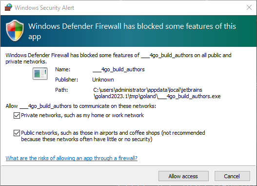

# Traffic can't hit to my local Windows PC ?

Answer:

Please make sure start up your application with choice like bellow.

- [x] Private networks, such as my home or work network
- [x] Public networks, such as those in airports and coffee shops (not recommended because these networks often have
  little or no security)



Or you can use follow command to check your firewall rule.

```shell
Get-NetFirewallRule -Direction Inbound -Action Block | Sort-Object -Property Priority
```

If there is a rule like this, you can delete it.

```shell
Name                          : {9127CE75-0943-4877-B797-1316948CDCA8}
DisplayName                   : ___go_build_authors.exe
Description                   : ___go_build_authors.exe
DisplayGroup                  :
Group                         :
Enabled                       : True
Profile                       : Public
Platform                      : {}
Direction                     : Inbound
Action                        : Block
EdgeTraversalPolicy           : Block
LooseSourceMapping            : False
LocalOnlyMapping              : False
Owner                         :
PrimaryStatus                 : OK
Status                        : The rule was parsed successfully from the store. (65536)
EnforcementStatus             : NotApplicable
PolicyStoreSource             : PersistentStore
PolicyStoreSourceType         : Local
RemoteDynamicKeywordAddresses :
PolicyAppId                   :
```

```shell
Remove-NetFirewallRule -Name "RuleName"
```