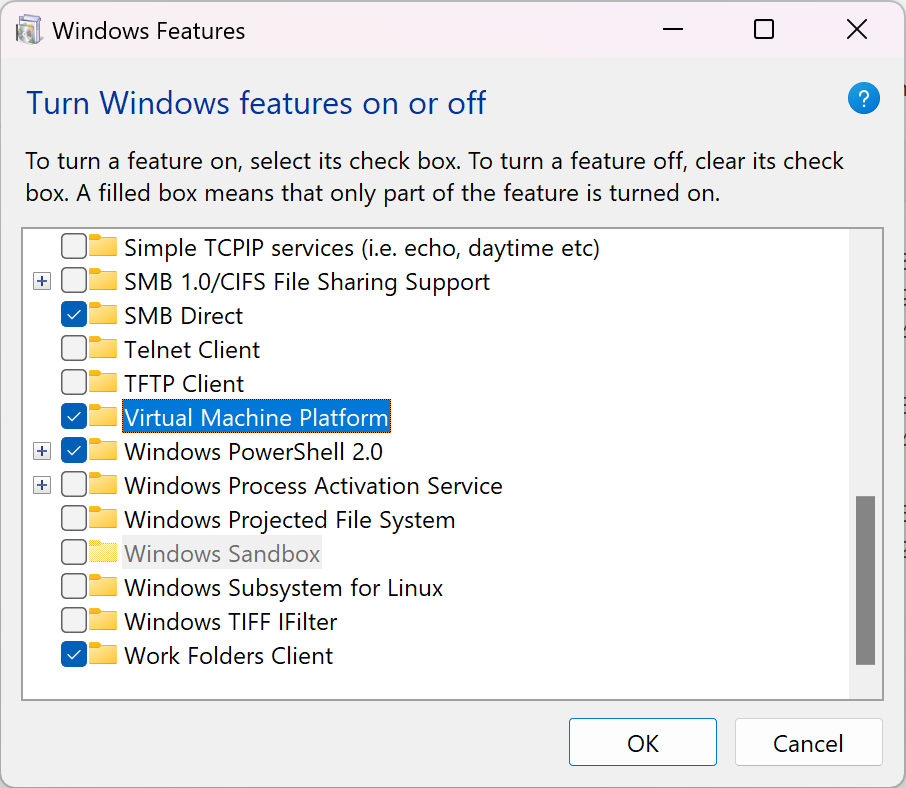

# On Windows 11 24H2 can't use any functions provide by kubevpn (eg access Service IP or Pod IP)?

## Solution:

Turning on Virtual Machine Platform (VMP) and everything works fine~

## Reference:

[docs](https://support.microsoft.com/en-us/windows/enable-virtualization-on-windows-c5578302-6e43-4b4b-a449-8ced115f58e1#:~:text=Step%20three%3A%20Turn%20on%20Virtual%20Machine%20Platform%20in%20Windows&text=Here's%20how%20to%20turn%20it,from%20the%20list%20of%20results)

