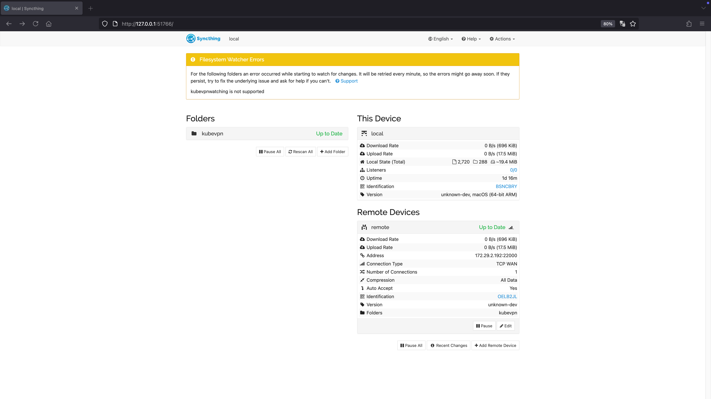

# Sync mode

Run deployment in same cluster, and cooperate with the service mesh to intercept the traffic
with the specified header or all the traffic to the sync deployment.

```shell
➜  ~ kubevpn sync deployment/authors -c authors --headers foo=bar --sync ~/GolandProjects/bookinfo-authors:/app/code
Starting connect
Got network CIDR from cache
Use exist traffic manager
Forwarding port...
Forwarding from 127.0.0.1:51744 -> 10800
Forwarding from [::1]:51744 -> 10800
Forwarding from 127.0.0.1:51745 -> 10801
Forwarding from [::1]:51745 -> 10801
Forwarding from 127.0.0.1:51746 -> 10802
Forwarding from [::1]:51746 -> 10802
Connected tunnel
Handling connection for 51744
Adding route...
Configuring DNS service...
Configured DNS service
Sync workloads...
Sync workload deployment/authors
Defaulted container "authors" out of: nginx, authors
Create sync resource Deployment.apps/authors-sync-108ce in target cluster
Wait for sync resource Deployment.apps/authors-sync-108ce to be ready

Pod authors-sync-108ce-6fc847b4c9-zjxlm is Pending...
Container Reason Message

Pod authors-sync-108ce-6fc847b4c9-zjxlm is Pending...
Type Reason Message

Pod authors-sync-108ce-6fc847b4c9-zjxlm is Pending...
Container Reason            Message
authors   ContainerCreating
nginx     ContainerCreating
syncthing ContainerCreating
vpn       ContainerCreating

Pod authors-sync-108ce-6fc847b4c9-zjxlm is Running...
Container Reason           Message
authors   ContainerRunning
nginx     ContainerRunning
syncthing ContainerRunning
vpn       ContainerRunning

Checking rollout status for deployment/authors
Waiting for deployment "authors" rollout to finish: 1 old replicas are pending termination...
Waiting for deployment "authors" rollout to finish: 1 old replicas are pending termination...
Rollout successfully for deployment/authors
Access the syncthing GUI via the following URL: http://127.0.0.1:51766
Now you can access resources in the kubernetes cluster !%
➜  ~
```

Use `kubevpn status` to display status

```shell
➜  ~ kubevpn status
CURRENT   CONNECTION ID   CLUSTER                 KUBECONFIG                         NAMESPACE    STATUS      NETIF
*         03dc50feb8c3    ccdpol3fqtofinnpvv720   /Users/naison/.kube/config         default      connected   utun5

          CONNECTION ID   NAMESPACE   NAME                       HEADERS   PORTS               CURRENT PC
          03dc50feb8c3    default     deployments.apps/authors   foo=bar   80->80,9080->9080   false

          CONNECTION ID   NAMESPACE   NAME                 HEADERS   TO NAME                          SYNCTHING GUI
          03dc50feb8c3    default     deployment/authors   foo=bar   deployments/authors-sync-108ce   http://127.0.0.1:51766
➜  ~
```

You can use browser to open `SyncthingGUI` address `http://127.0.0.1:51766`



- After synchronize process finished, all local code synced to k8s `deployment/authors-sync-108ce`
- You can start up application in this pod manually
- All traffic with header `foo=bar` will hit `deployment/authors-sync-108ce`, other traffic will hit origin
  `deployment/authors`