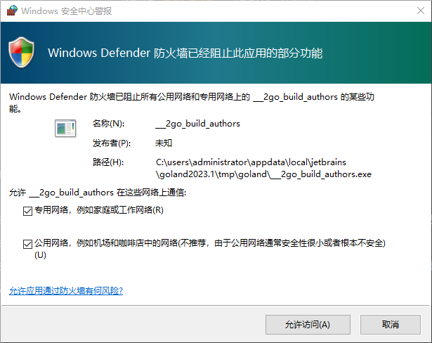

# 流量无法打到我的本地 Windows 电脑?

答案:

请确保你的应用程序以以下方式启动。

- [x] 专用网络,例如家庭或工作网络(R)
- [x] 公用网络,例如机场和咖啡店中的网络(不推荐,由于公用网络通常安全性很小或者根本不安全)(U)



或者你可以使用以下命令检查你的防火墙规则。

```shell
Get-NetFirewallRule -Direction Inbound -Action Block | Sort-Object -Property Priority
```

如果有这样的规则,你可以删除它。

```shell
Name                          : {9127CE75-0943-4877-B797-1316948CDCA8}
DisplayName                   : ___go_build_authors.exe
Description                   : ___go_build_authors.exe
DisplayGroup                  :
Group                         :
Enabled                       : True
Profile                       : Public
Platform                      : {}
Direction                     : Inbound
Action                        : Block
EdgeTraversalPolicy           : Block
LooseSourceMapping            : False
LocalOnlyMapping              : False
Owner                         :
PrimaryStatus                 : OK
Status                        : The rule was parsed successfully from the store. (65536)
EnforcementStatus             : NotApplicable
PolicyStoreSource             : PersistentStore
PolicyStoreSourceType         : Local
RemoteDynamicKeywordAddresses :
PolicyAppId                   :
```

```shell
Remove-NetFirewallRule -Name "RuleName"
```