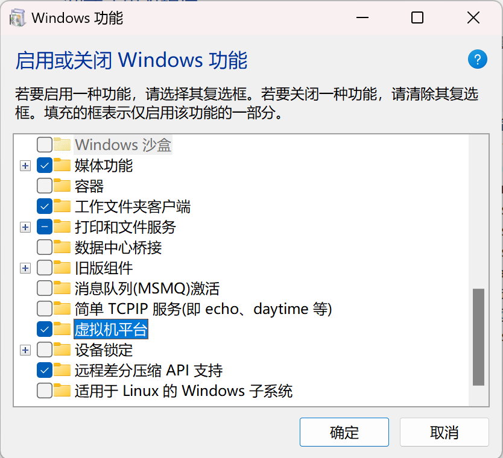

# 在 Windows 11 24H2 上无法使用 kubevpn 的任何功能 (例如访问 Service IP 或者 Pod IP)?

## 解决方案:

开启虚拟机平台 (VMP), 然后所有功能都可以正常使用了。

## 参考资料:

[文档](https://support.microsoft.com/zh-cn/windows/%E5%9C%A8-windows-%E4%B8%8A%E5%90%AF%E7%94%A8%E8%99%9A%E6%8B%9F%E5%8C%96-c5578302-6e43-4b4b-a449-8ced115f58e1)

